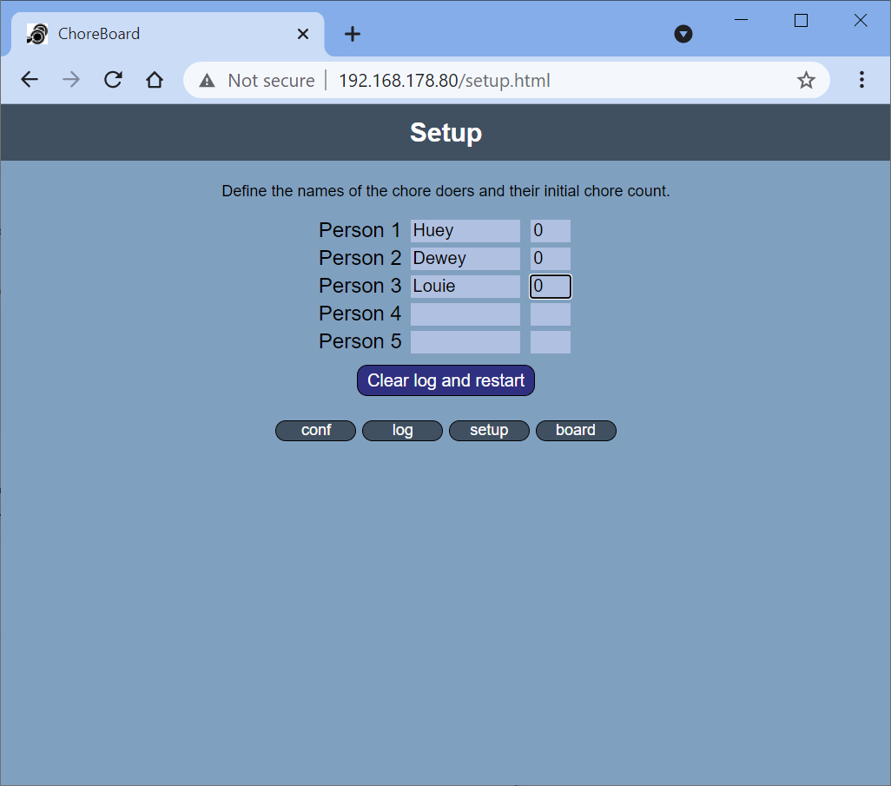
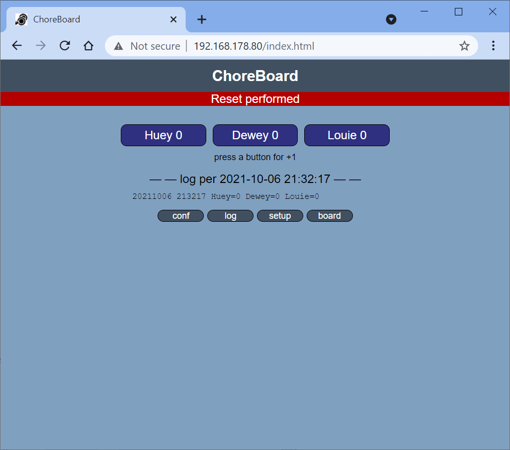
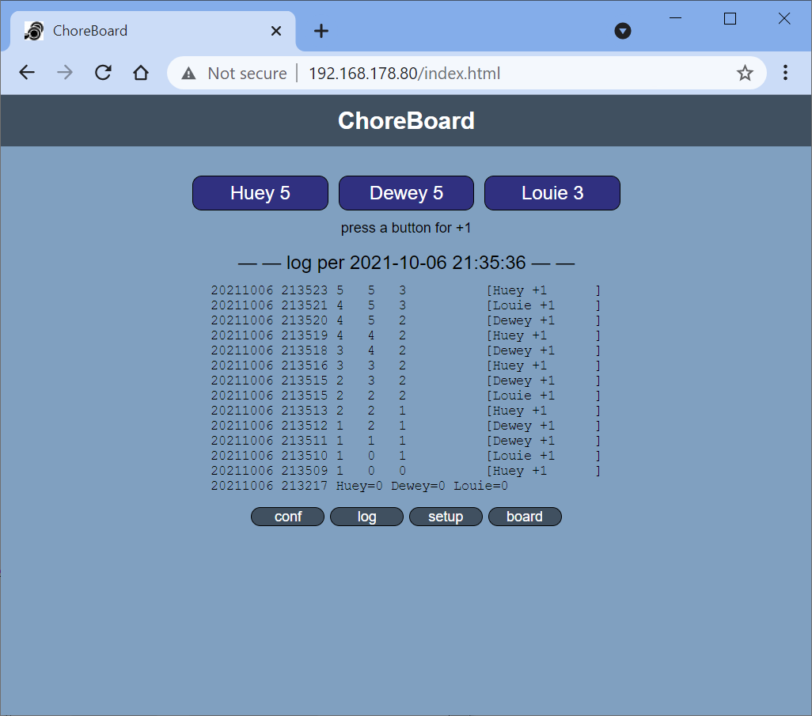

# ChoreBoard
Keeping track of who should do the next chore.


## Introduction

ChoreBoard is a very simple web server application running on an ESP8266.

One time, connect to the server and execute `setup` to define a list of chore-doers (max 5).
In the example below Huey, Dewey and Louie are configured, each with a history of 0 chores done.



Once the setup is executed, you go to the main page.



This page shows the current status of the chore-doers: which is at this moment that each one did 0 chores.
By pressing the blue button, the chore doer gets a "+1", so after a while the main page looks like this.



To prevent fraude between the chore-doers, the main page logs all +1's.
To keep the app simple, there are no log-in accounts.


## ESP8266 project

This is an Arduino project (I have 1.8.13) for the ESP8266 (I have 3.0.2); it uses some libraries.

- `ESP8266WiFi`
  A standard library for ESP8266, enabling it to become a node in my home network.
  It will use the network to synchronize its time, and to offer web pages to view and log completed chores.

- `time`
  A standard library for ESP8266. 
  By passing it these settings (timezone and NTP servers), the ESP always knows local time.
  ```
  #define TZ   "CET-1CEST,M3.5.0,M10.5.0/3" // Amsterdam
  #define SVR1 "pool.ntp.org"
  #define SVR2 "europe.pool.ntp.org"
  #define SVR3 "north-america.pool.ntp.org"

  configTime(TZ, SVR1, SVR2, SVR3);  
  ```
  I learned that in my [WordClock project](https://github.com/maarten-pennings/WordClock#7-Keeping-time).
  
- `LittleFS`
  Also a [standard library](https://arduino-esp8266.readthedocs.io/en/latest/filesystem.html) 
  for ESP8266. It is the successor to SPIFS.
  The trick is that your Arduino project gets a `data` directory.
  This directory has the files that the ESP8266 needs. 
  In my case a `log.json` with a log of all chores done so far, and the `index.html` to show them.
  There is a plugin for Arduino, that writes those file the a part of the flash that is not used for our application.
  See [instructions](https://microcontrollerslab.com/littlefs-introduction-install-esp8266-nodemcu-filesystem-uploader-arduino/)
  for installing and using that plugin.


- `ESPAsyncTCP` and `ESPAsyncWebServer`
  I downloaded and installed those libraries [here](https://github.com/me-no-dev/ESPAsyncTCP) (I have 1.2.2)
  and [here](https://github.com/me-no-dev/ESPAsyncWebServer) (I have 1.2.3).

## Getting started

- Install [Arduino](https://www.arduino.cc/en/software) and the [ESP8266](https://randomnerdtutorials.com/how-to-install-esp8266-board-arduino-ide/) compiler.
- Install the LittleFS plugin (see above) in Arduino.
- Install the Async libraries (see above).
- Create a `credentials.h` file in your project with your WiFi credentials.
- Compile and upload the ChoreBoard application to an ESP8266 (e.g. NodeMCU) board.
- With the Arduino plugin (see above), upload the file system to the ESP8266 board.
- Reset the board to run the ChoreBoard application, and observe its IP number printed via Serial.
- On a mobile phone or PC open a browser to that IP number, click `setup` and add the chore-doers.
  When pressing the actual `Clear log and restart button` have the "flash" button on the ESP8266 pressed (security feature).
- From then on, once a chore is done, click a "+1" button on the ESPs main web page.

(end)
